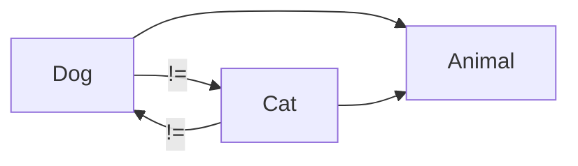
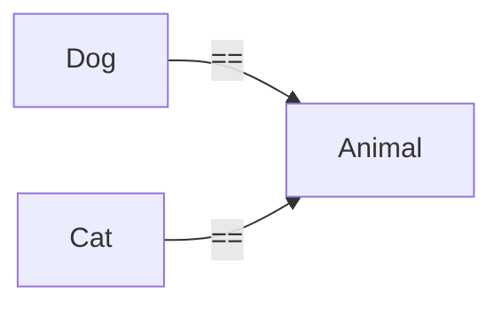

# 동등성

## 왜 같은 부모를 상속한 객체간의 equals는 false가 나오는가?

### 규약
- 그러나 단순한 규약이 아닌 동치 관계를 성립 시키기 위한 최소 조건
#### 반사성
```java
x.equals(x);
```
- 위 경우 항상 참이어야 한다가 반사성이다.
- 자기 자신과 같지 않을 수는 없기 떄문이다.
  - 이게 성립하지 않는다면 `contains(x)` 는 항상 false가 나올것

#### 대칭성
```java
x.equals(y); //true
y.equals(x); // ?
```
- x가 y와 같다면 그의 역 또한 참이다.
- 만약 이게 성립하지 않는다면?
  - x -> x1 로 단방향으로 성립한다고 했을 때
  - `{x, x1}` 인 리스트에서 `contain(x)` 를 했을 때 한쪽은 포함, 한쪽은 미포함으로 처리됨

#### 추이성
- `x -> y`, `y -> z` 일 때 `x -> z` 또한 같아야 한다

#### 일관성
- `x.equals(y)` 의 결과는 두 객체의 상태가 변하지 않는 한 같아야 한다


### `false`여야만 하는 이유

#### 대칭성

- Dog == Cat이 되어야한다.
  - 구현에 따라 다른 필드 또는 다른 메서드를 가지고 있을 수 있음

#### 추이성

- `Dog == Animal`, `Cat == Animal`
  - `x = y`, `y = z`라면 추이성에 의해 `x = z` 또한 성립 해야한다.
  - 그러나 현실적으로 이 둘은 서로 타입도 의미도 다르다


# 마무리
- 위의 이유에 따라 같은 부모를 상속한 자식 클래스들 끼리는 equals가 성립하지 않아야 한다.
- 만약 이 위의 이유를 불문하고 true가 나오게 하겠다면 `instanceof` 상속 클래스를 확인하면 될 것 같다.